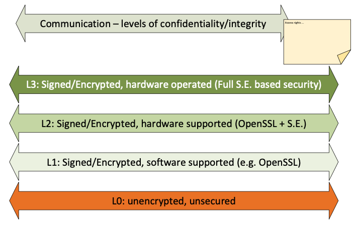

####################################
Architecture
####################################

The Flex4Apps framework consists of several components that are described in the following section.  For the sake of clarity, however, it is worth dividing it into two main components:

1. the Cyber-Physical-Systems - hardware, paired with software, which stands locally. This can range from a simple temperature sensor to a highly complex network communication device.
2. The Cloud System - a software solution that receives, processes, stores and displays data collected by Cyber-Physical Systems.

.. image:: f4a_architecture.png

Cloud architecture
===================
The Cloud architecture describes the software components of the Flex4Apps framework. The four main components are described below

Cloud staging
-------------
The Cloud Staging component takes care of the receipt and the cloud storage of data delivered by the CPS side. There are no restrictions on the Flex4Apps framework for file formats and communication protocols.

**Interfaces**
The standards defined in the OSI model level 4 to 7 are used here. Data can thus be transmitted via HTTP / S, FTP / S, SMTP, SNMP, TCP, UDP.

**Security**
The security of the cloud staging can be done at different levels. If the data has already been encrypted at the application level, an unsecured transmission level can be selected.

As a transition between Cloud and CPS side, a special emphasis is placed on security.

Cloud storage
-------------------
The cloud storage component processes the data from the cloud staging area and transfers it to a database model according to standardized calculations. First clean-up activities are already carried out, which are characterized by regional standards. Here, above all, a uniform date, decimal & number groupings must be mentioned. The storage component also considers indexing requirements

Cloud processing
-------------------
The cloud processing transforms the prepared data into quickly evaluable information. Based on a supplementary rule set, data are transformed, calculated, adjusted and processed.

Cyber-Physical Architektur
===================

Device
-------------------
The simplest "device" within the Flex4Apps framework is the device. It can collect data and receive / execute commands. A separate decision logic can be present but is not assumed. The task of the device is to ensure the communication to the next higher communication stage within the CPS constellation. The Flex4Apps framework also allows the device to communicate directly with the cloud.

**Interfaces**
Are not considered within the framework of the Flex4Apps project. Provided communication with the higher-level cloud systems is ensured.

**Security**
The communication is protected according to the environment, this can be controlled by physical access restrictions, secure transport channels as well as the use of encryption technologies.

Aggregator
-------------------
The "Aggregator" is an administering instance for several "devices". It assumes the conditional control logic for connected devices.

**Interfaces**
It provides a standardized interface (here REST) for controlling the assigned devices.

**Security**
Communication to and from the aggregator runs according to defined security levels.

Communicator
-------------------
The "Communicator" is the interface between the CPS world and the cloud system. The management of several assigned "aggregators" and "devices" takes place at the top level. A standardized interface (here REST) enables the detailed control of the connected system landscape.

**Interfaces**
Rest, Syslog – Other standards that can be received by Cloud Staging.

**Security**
The communicator must be able to act as plug & trust communication bridge between the the CPS side and the cloud side

The Flex4Apps architecture allows the use of "custom business logic" to illustrate specific actions that are not solved by the Flex4Apps framework itself.

Security levels
===============
Various security levels should be considered when implementing the Flex4Apps architecture.

